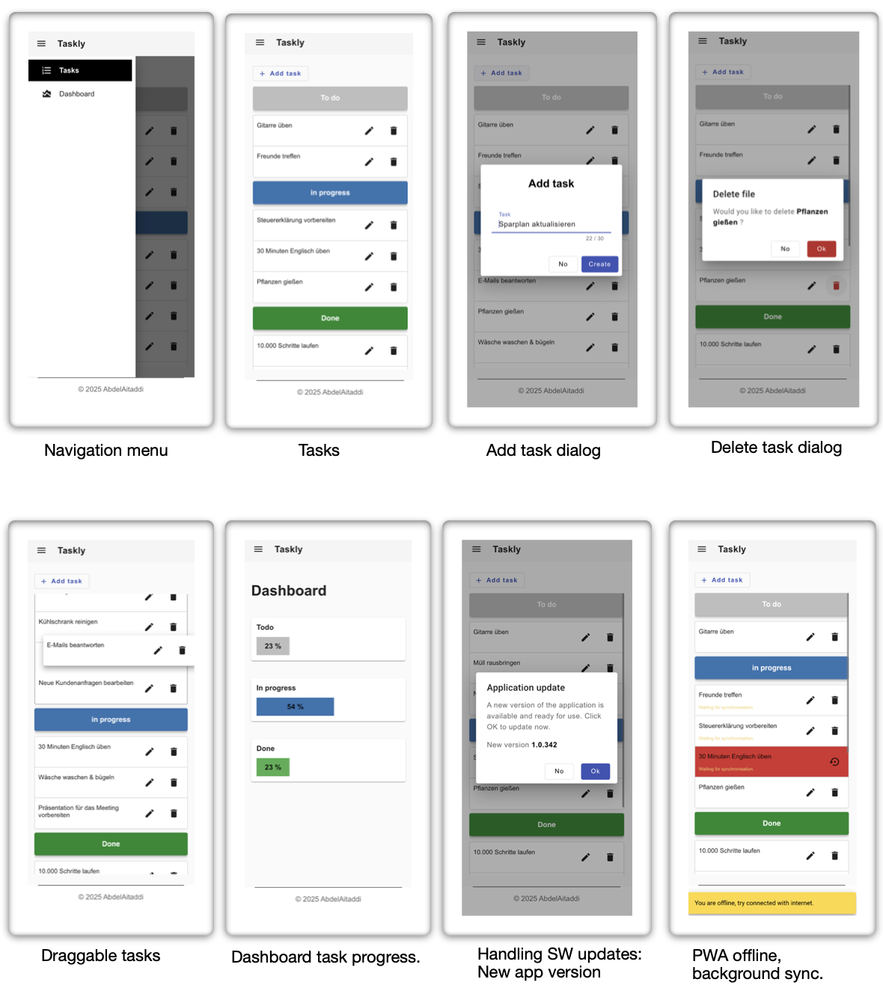

# Angular PWA IndexedDB ⚡ Zoneless ⚡

## Example project: Todo App (Taskly).



> Todo App (Taskly)
>
> A project designed to get started with Angular Signals, async reactivity with Resources, Dexie.js (IndexedDB), and Progressive Web Application (PWA) development for modern, high-performance state management. It includes:
>
> - Dexie.js as a wrapper for IndexedDB for efficient local storage.
> - PWA (Progressive Web App) allows users to access and interact with the app even when offline.
> - Background Sync automatically synchronizes pending CRUD operations with the backend when the network is restored.
>

> Built using Angular CLI 19.2.0 & Json-server.

## Purpose

When building a PWA (Progressive Web App) with Angular, maintaining a seamless user experience offline and ensuring data consistency when the user comes back online is crucial.
This is where Dexie.js and Background Sync come into play.

The goal of this app is to introduce how to transform an Angular application into a PWA, ensuring a seamless user experience even when offline. It leverages Dexie.js for local storage and Background Sync for automatic data synchronization.

Users can create, update, and delete data without an active internet connection. Once they go back online, all pending changes are automatically synchronized with the backend.

Additionally, the app detects new versions and notifies users when an update is available, prompting them to refresh for the latest features and improvements. This ensures data consistency, reliability, and a smooth experience regardless of network conditions. 🚀

Use case in an offline Angular Todo app:

- A user add new/update/delete a task while offline → Dexie.js stores it locally.
- When the user reconnects → Background Sync pushes the changed task to the backend.
- The task is then marked as synced, ensuring data consistency.

## Project Structure

```
src/
 │
 │────── app/
 │        │────── core/
 │        │         │────── config/
 │        │         │────── layout/
 │        │         │────── no-layout/
 │        │         │────── services/
 │        │
 │        │────── features/
 │        │         │
 │        │         │────── dashboard
 │        │         │          │────── components/
 │        │         │          │────── containers/
 │        │         │          │────── facades/
 │        │         │
 │        │         │────── tasks
 │        │         │         │────── components/
 │        │         │         │────── containers/
 │        │         │         │────── facades/
 │        │         │         │────── models/
 │        │         │         │────── services/
 │        │         │         │────── helpers/
 │        │         │
 │        │────── shared/
 │        │         │────── components/
 │        │
 │        │
 │        │ app.components.ts
 │        │ app.config.ts
 │        │ app.routes.ts
 │
 │────── styles/
 │        │────── .../
 │
 │ main.ts
 │ index.html
 │ styles.scss
```

## Try it

_**Run it in dev mode:**_

1 - Run first `npm ci`.  
2 - Run `npm start` for a dev server and then `npm run db` for database.  
3 - Navigate to `http://localhost:4200/`.

The application will automatically reload if you change any of the source files.

_**Or run it in prod mode, for PWA Test:**_

1. Run first `npm ci`.
2. Run `npm run build` for build the app.
3. Run `npm run start-server` for a prod server and then `npm run db` for run database.
4. Navigate to `http://localhost:8080/`.

Using a private (incognito) browser can help avoid caching issues.

## Version

This project was generated with:

angular-cli: `19.2.0`

node: `^22.13.0`

npm: `^10.9.1`
